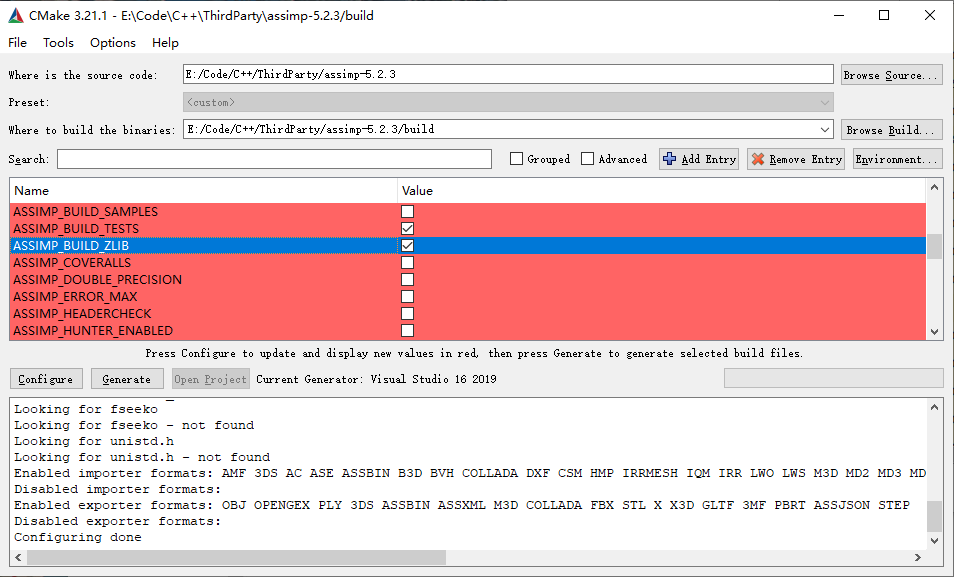
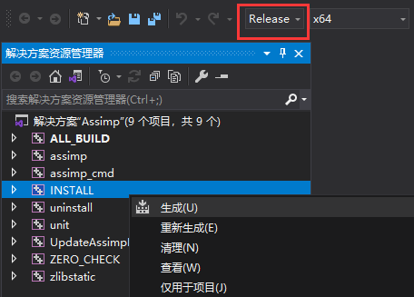
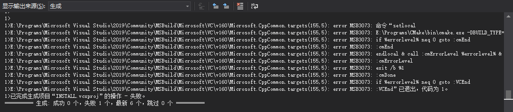
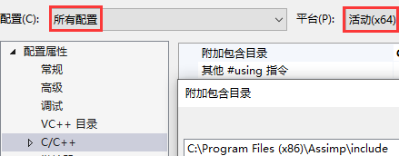
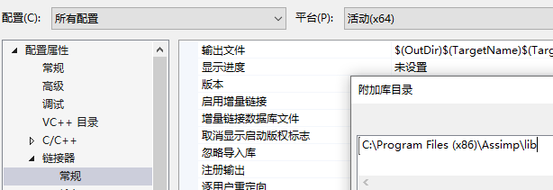
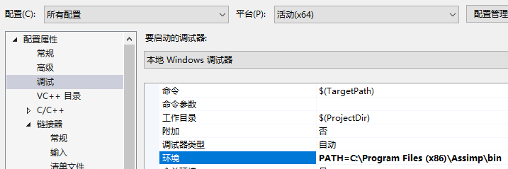

# 安装Assimp

[点此下载Assimp源码](https://github.com/assimp/assimp/releases)

[点此下载CMake](https://cmake.org/download/)

在安装好CMake后，将Assimp源码解压，然后运行cmake-gui.exe，填写源码位置和build binaries的位置，点击Configure选择你所拥有的Visual Studio版本后确定。等待CMake完成配置过程后，在中间可以看到大量新出现(红颜色标记)的配置属性。由于目前较新版本的Assimp需要使用ZLIB，而通常本机是没有编译过ZLIB的，我们需要在下图中找到`ASSIMP_BUILD_ZLIB`项并将其勾选：



与此同时我们要找到`CMAKE_INSTALL_PREFIX`确定Assimp安装的位置，默认为`C:/Program Files (x86)/Assimp`，当然你也可以进行更改，但需要记住安装的位置在后面教程项目配置的时候需要用到。

完成上述配置后点击Generate就会生成Visual Studio项目。然后我们需要以**管理员身份**打开Visual Studio，并打开`Assimp.sln`。

我们需要分别以**Release x64**和**Debug x64**配置各生成一次，右键**INSTALL**生成就会自动编译并将生成的静态库、动态库以及头文件复制到`CMAKE_INSTALL_PREFIX`确定的路径中：



如果出现以下情况也不代表就是失败了



完成两次生成后，应该去`CMAKE_INSTALL_PREFIX`的路径检查文件情况，应该可以看到文件结构大致如下：

```cpp
Assimp
|---bin
|   |---assimp.exe
|   |---assimp-vc14*-mt.dll
|   |---assimp-vc14*-mtd.dll
|---include
|   |---assimp
|---lib
    |---cmake
    |---pkgconfig
    |---assimp-vc14*-mt.lib
    |---assimp-vc14*-mtd.lib
    |---zlibstatic.lib
    |---zlibstaticd.lib
```

# 将Assimp添加到你的项目中

在项目属性页中，选择C/C++ → 常规 → 附加包含目录，添加Assimp头文件所在路径：



选择链接器 → 常规 → 附加库目录，添加Assimp库目录：



然后是动态库，一般有两种处理方式：

- 将`assimp-vc14*-mt.dll`和`assimp-vc14*-mtd.dll`复制到你项目路径中(`*.vcxproj`所在位置)
- 添加调试环境，选择调试 → 环境，添加`PATH=C:\Program Files (x86)\Assimp\bin`，这样程序运行的时候就会额外在该路径寻找动态库了



到此Assimp的配置就结束了。

