目前提供两种方案：

- 从Visual Studio新建项目
- 安装VS，但使用Visual Studio Code + CMake的方案建立项目

# 从Visual Studio新建项目

新建项目从Windows桌面向导开始：

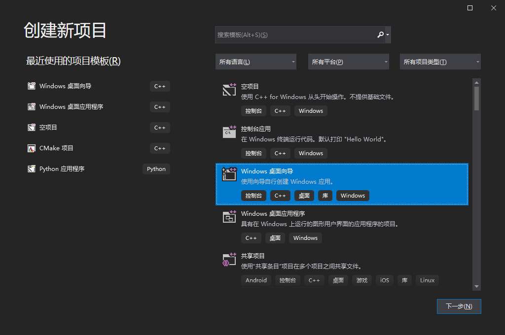

在填写好项目名称后，点击创建会弹出这样一个子窗口。我们需要按下图的方式操作来创建出一个空项目的桌面应用程序，最后点击确定即可：

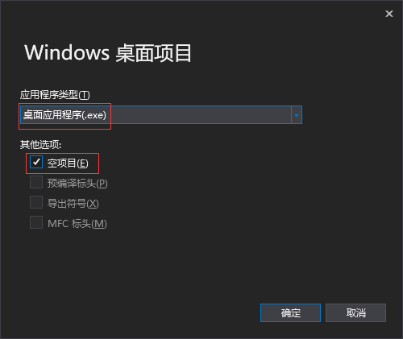

**以项目01为例，现在你可以尝试将本教程项目01中用到的所有头文件和源文件复制到你的项目目录，再把它们拖进你的项目中。**

## 链接静态库

可以在`d3dApp.h`添加下面的语句：

```cpp
#pragma comment(lib, "d3d11.lib")
#pragma comment(lib, "dxgi.lib")
#pragma comment(lib, "dxguid.lib")
#pragma comment(lib, "D3DCompiler.lib")
#pragma comment(lib, "winmm.lib")
```

也可以在项目属性-链接器-输入-附加依赖项 添加上面的库。

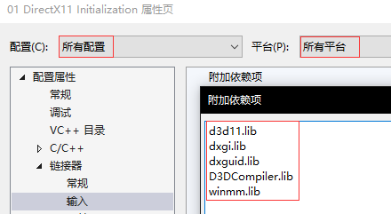


## 移除你的项目中有关DX SDK的库路径和包含路径

**如果你曾经用过DX SDK来编写DX项目，务必要把你之前配置的DX SDK库路径和包含路径给清理掉，使用项目默认的库路径和包含路径！**

## 字符集设置为Unicode

在项目属性页中可以直接进行修改。当然现在比较新的VS都默认使用Unicode字符集。

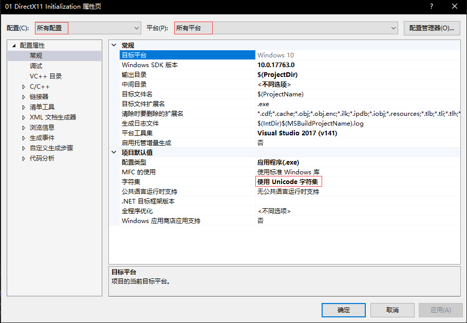

## Win7系统下的额外配置

由于Win10 SDK中的某些函数在Win7是不支持的，我们还需要在属性页-配置属性-C/C++ -预处理器中，添加预处理器定义以限制API集合：`_WIN32_WINNT=0x601`


## 文件本身的编码设置及编译时编码识别

- 通常从VS新建的头文件/源文件代码页为**简体中文(GB2312)-代码页936**。在所有文件代码页都为936的情况下，可以使用中文
- VS在看到**Unicode(UTF-8有签名)-代码页65001**编码的文件时，可以根据文件头信息识别为UTF-8文件，否则当做为当前代码页
- 使用**Unicode(UTF-8无签名)-代码页65001**编码的文件由于VS看不到UTF-8文件头，会当做当前代码页，中文内容识别不出来，需要编译时强制指定以utf-8的编码的形式读取

在项目属性页-C/C++ -命令行中添加`/utf-8`来强制指定代码页

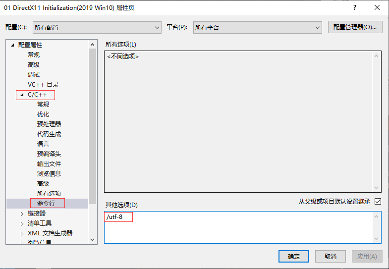

当前所给项目下的绝大部分*.cpp, *.h, *.hlsl, *.hlsli使用的文件编码为**Unicode(UTF-8无签名)-代码页65001**

但从VS创建出来的文件默认编码是ANSI编码（详细的为**简体中文(GB2312)-代码页936**），需要对非UTF-8无签名编码的文件进行转码。种比较麻烦的方法是，在解决方案资源管理器中选中指定文件后，点击文件-另存为-编码保存，最后找到**Unicode(UTF-8无签名)-代码页65001**保存即可。

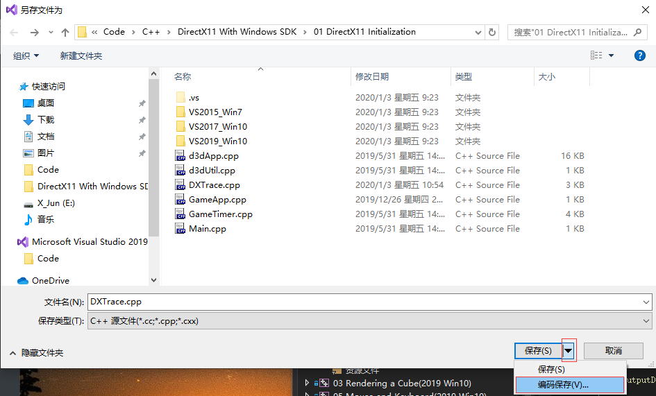

**还有一种办法是在VS安装扩展。在扩展-管理扩展，然后找到Force UTF-8(No BOM)安装**：

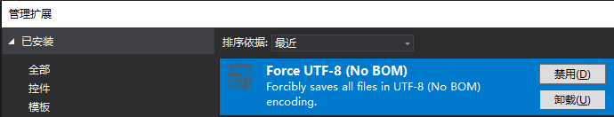

安装该插件后，在你保存代码的时候就会强制修改文件编码为UTF-8了。

> 注意：HLSL编译器要求着色器文件是**ANSI编码**，使用UTF-8编码的HLSL文件如果只是注释为中文还是没有问题的，但不能在代码部分出现中文，否则编译不通过。

## 子系统问题

如果你是直接用空项目的模板创建的项目，那很可能会遇到下面的问题：

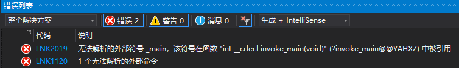

因为默认的空项目指定的子系统有可能是未明确，也可能是控制台（用的是传统的`main`函数而不是`WinMain`）。为此还需要修改项目配置。

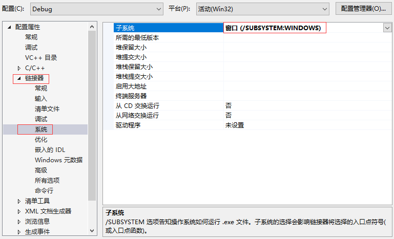

## 安装HLSL扩展

点击菜单栏扩展-管理扩展，搜索`HLSL Tools for Visual Studio`并安装，这样后续查看、编写HLSL文件就拥有了更加丰富的代码高亮和提示。

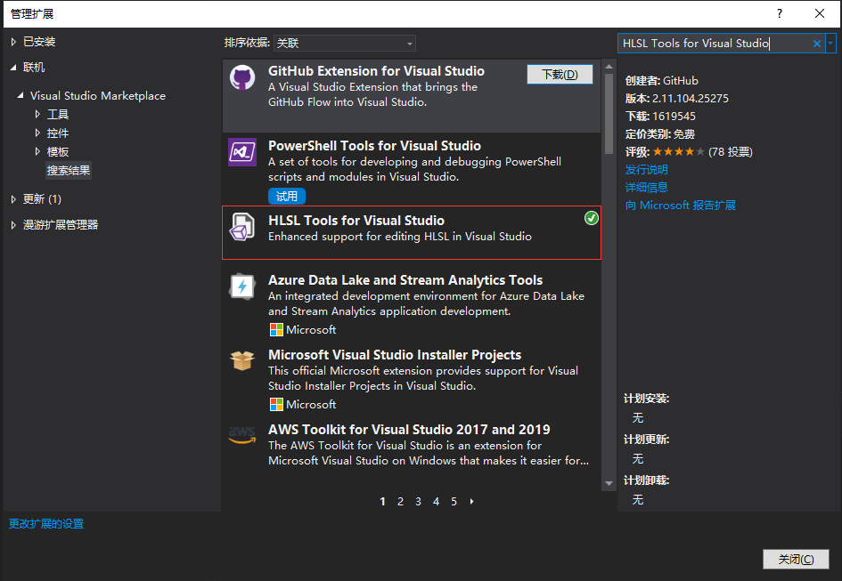

# 使用Visual Studio Code + CMake

这种方式仍需要你先安装好Visual Studio，如果你考虑使用RenderDoc作为图形调试器，又或者对CMake比较熟悉的话可以尝试。

首先直接在扩展中安装`C/C++ Extension Pack`，里面包含我们需要用到的一些插件

新建一个空文件夹，然后在VSCode中打开

然后新建一个CMakeLists.txt。下面提供一个cmake的简单模板

```cmake
cmake_minimum_required (VERSION 3.12)

project("DirectX11 Test")

set(CMAKE_CXX_STANDARD 17) 
add_compile_definitions(UNICODE _UNICODE)
# add_compile_definitions(_WIN32_WINNT=0x601)  # Win7使用
add_compile_options("$<$<CXX_COMPILER_ID:MSVC>:/utf-8>")
# 编写好的着色器放在HLSL文件夹中
file(COPY HLSL DESTINATION ${CMAKE_CURRENT_BINARY_DIR})

# 项目名为 DirectX11_Test
aux_source_directory(. DIR_SRCS)
add_executable(DirectX11_Test WIN32 ${DIR_SRCS})
target_link_libraries(DirectX11_Test d3d11.lib dxgi.lib dxguid.lib D3DCompiler.lib winmm.lib)

#
# Assimp 
#

# set(Assimp_INSTALLED_DIR "C:/Program Files (x86)/Assimp")
# target_link_libraries(DirectX11_Test "${Assimp_INSTALLED_DIR}/lib/assimp-vc${MSVC_TOOLSET_VERSION}-# mt$<$<CONFIG:Debug>:d>.lib")
# include_directories(${Assimp_INSTALLED_DIR}/include)
# set_target_properties(DirectX11_Test PROPERTIES VS_DEBUGGER_ENVIRONMENT "PATH=${Assimp_INSTALLED_DIR}/bin")

#
# ImGui 需要将项目中的ImGui文件夹复制进来
#

# add_subdirectory(ImGui)
# add_compile_definitions(USE_IMGUI)
# target_link_libraries(DirectX11_Test ImGui)
# file(COPY imgui.ini DESTINATION ${CMAKE_CURRENT_BINARY_DIR})

# 输出文件名
set_target_properties(DirectX11_Test PROPERTIES OUTPUT_NAME "DirectX11 Test")
# Debug输出exe到项目文件夹中
set_target_properties(DirectX11_Test PROPERTIES RUNTIME_OUTPUT_DIRECTORY_DEBUG ${CMAKE_CURRENT_BINARY_DIR})
# Release输出exe到项目文件夹中
set_target_properties(DirectX11_Test PROPERTIES RUNTIME_OUTPUT_DIRECTORY_RELEASE ${CMAKE_CURRENT_BINARY_DIR})

```

将源代码放进文件夹，着色器放入`HLSL`文件夹内。

然后ctrl + shift + P调出用于执行命令的输入框，找到`CMake：快速入门`，然后根据你安装的VS版本选择toolkit，若本机为64位，直接选择`amd64`版本的。每次修改cmake后需要保存，然后cmake就会自动运行并生成VS项目(但不需要打开)。在下方的菜单栏选择build会编译项目。编译成功后就可以调试或运行了。

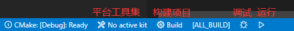
