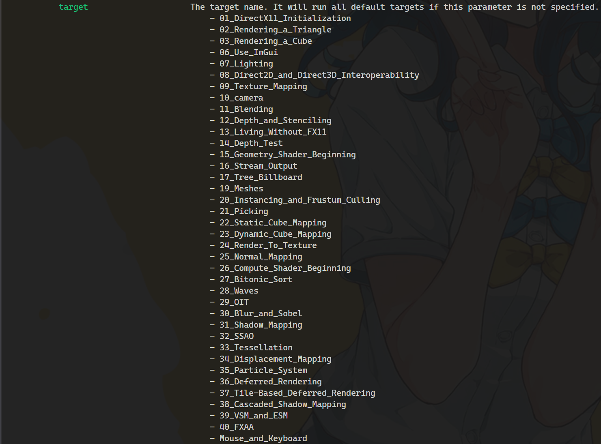
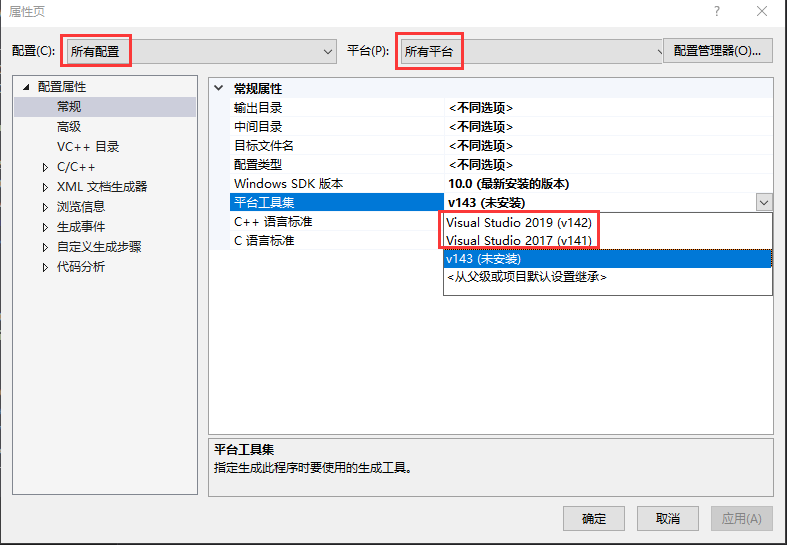
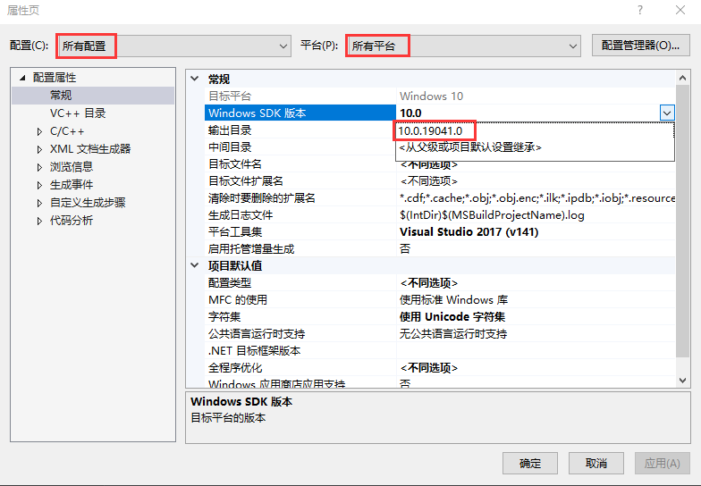
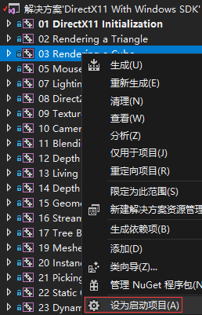
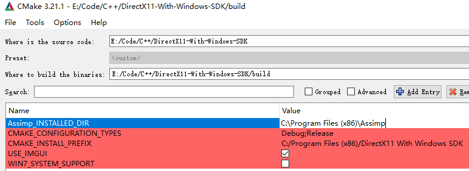

# DirectX11 With Windows SDK教程演示项目

 

现代DX11系列教程：使用Windows SDK(C++)开发Direct3D 11.x

**目前部分项目已支持ImGui**

## 最近更新

2022/5/14 Ver1.36.1

- 调整项目38-39代码

**[历史更新记录](https://github.com/MKXJun/DirectX11-With-Windows-SDK/blob/master/MarkdownFiles/Updates/Updates.md)**

## 博客教程

目前对应的博客更新：

[**Github在线版（优先保证最新）**](https://mkxjun.github.io/DirectX11-With-Windows-SDK-Book) 

**[博客园](https://www.cnblogs.com/X-Jun/p/9028764.html)**

**因更新麻烦，CSDN目前考虑停更**

## QQ群交流

QQ群号：727623616

欢迎大家来交流，以及项目有什么问题也可以在这里提出。

## 项目概况

语言: 
- C++14/17 
- HLSL Shader Model 5.0

目前项目使用了下述代码库或文件：
- [ocornut/imgui](https://github.com/ocornut/imgui)：当前已经为这些项目使用ImGui：第7、10、15、16、17、20、23、30-38章。 
- [nothings/stb](https://github.com/nothings/stb)：使用其stb_image 
- [assimp/assimp](https://github.com/assimp/assimp)：模型加载 
- [DirectXTex/DDSTextureLoader](https://github.com/Microsoft/DirectXTex/tree/master/DDSTextureLoader) 
- [DirectXTex/WICTextureLoader](https://github.com/Microsoft/DirectXTex/tree/master/WICTextureLoader) 
- [DirectXTex/ScreenGrab](https://github.com/Microsoft/DirectXTex/tree/master/ScreenGrab) 
- [DirectXTK/Mouse(源码上有所修改)](https://github.com/Microsoft/DirectXTK/tree/master/Src)：不能和imgui同时使用 
- [DirectXTK/Keyboard(源码上有所修改)](https://github.com/Microsoft/DirectXTK/tree/master/Src)：不能和imgui同时使用 

作为教程演示项目，这里并不是以实现一个软引擎为目标。建议读者在跟随教程学习的同时要动手实践。

## 安装Assimp

打开36章之后的项目需要先安装并配置好Assimp，具体过程 **[点此查看](https://github.com/MKXJun/DirectX11-With-Windows-SDK/blob/master/MarkdownFiles/How-To-Build-Assimp/README.md)**

## 打开教程项目

**对于Win10系统，直接打开DirectX11 With Windows SDK(2022 Win10).sln**

**对于Win7和Win8.x的系统，请阅读 cmake构建项目一节**

如果你使用的是**VS2017**或**VS2019**，则需要全选项目然后右键属性：

然后修改平台工具集为你当前有的版本：

如果是VS2017，还需要选择当前你所拥有的Windows SDK版本：

建议使用**Debug x64或Release x64**的属性配置来生成项目，**Release x64会更快**。36章之后的项目需要先按照Assimp的配置。生成完成后，若要指定运行哪个项目，需要对项目右键-设为启动项。

> **注意：** 
> 1. **目前教程仅支持VS2017(平台工具集v141)及更高版本！**
> 2. 如果需要使用Direct2D/DWrite，Win7系统需要安装Service Pack 1以及KB2670838补丁，但目前更推荐使用ImGui

## CMake构建项目

首先需要安装Assimp，**[点此查看](https://github.com/MKXJun/DirectX11-With-Windows-SDK/blob/master/MarkdownFiles/How-To-Build-Assimp/README.md)**

安装好后，使用`cmake-gui.exe`填写源码路径和构建路径，然后会弹出下述变量：

- `Assimp_INSTALLED_DIR`：需要填写，项目36之后的会用到Assimp
- `USE_IMGUI`：默认开启，关闭后35之前的部分项目使用Direct2D的UI
- `WIN_SYSTEM_SUPPORT`：默认关闭，仅Win7用户需要勾选，但建议保持`USE_IMGUI`开启

再次点击`Configure`会看到`Assimp_DIR`的出现，说明找到了Assimp，然后就可以点`Generate`生成项目，生成的项目位于build文件夹内，或者点`Open Project`打开

## 创建自己的项目

如果有想要把源码copy到自己的VS项目，又或者是想在VSCode来编写的，**[点此查看](https://github.com/MKXJun/DirectX11-With-Windows-SDK/blob/master/MarkdownFiles/How-To-Build-Your-Project/README.md)**

## 支持/赞赏博主
**博客和项目维护不易，如果本系列教程对您有所帮助，希望能够扫码支持一下博主。**

## 遇到项目无法编译、运行的问题
**[点此查看无法编译、运行教程项目的解决方法](https://github.com/MKXJun/DirectX11-With-Windows-SDK/blob/master/MarkdownFiles/How-To-Build-Solution/README.md)**

## 使用Direct3D 11.x(Windows SDK)编写的魔方

**[点此查看](https://github.com/MKXJun/Rubik-Cube)**

